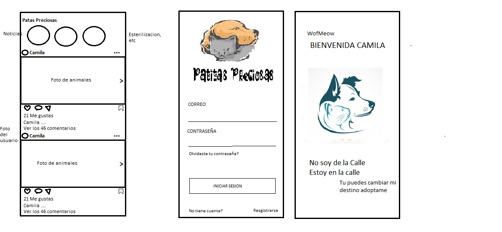
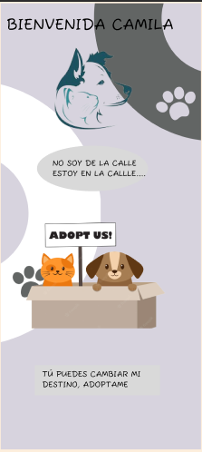

# Patitas Preciosas

## Una Red Social creada para las personas amantes de los Animales 

Esta red social es creada como una iniciativa para fomentar que menos animales se encuentren
sufriendo en las calles, los principales usuarios son las personas amantes de estos. 
Permite a cualquier usuario registrarse a la red social una vez echo, ya cuenta 
con un correo y contraseña, tambien se puede registrar con una cuenta de google y acceder al 
home donde el usuario puede ; crear, editar,borrar, likear, ver la fecha de la publicacion, tambien contará con un espacio para ver informacion de las veterinarias cercanas y el boton de cerrar sesion. 

### Producto Final de la red social 

#### Version Mobile

#### ¿Quiénes son los principales usuarios del producto?

Toda las personas amantes de los animales que quieran adoptar perritos o gatitos; aquellas personas que tienen animales en casa y ya no puedan solventar el gasto o tengan que cambiar de domicilio, por ello tendrían que dar en adopción.
Un ejemplo es de un usuario que visualiza cachorros abandonados pasando pena, este usuario puede usar la red social y hacer la publicación para que personas interesadas puedan adoptarlo. 

#### ¿Cómo mi producto resuelve un problema o necesidad?

Mas usuarios tendrían la oportunidad de poder adoptar, por ende disminuiría la población callejera 
de los animales y tendrian un hogar donde vivir.

#### prototipos de baja fidelidad   

 #### Prototipos de alta fidelidad

 
 

 #### Resumen del feedback recibido tanto de los coaches como de nuestras compañeras

 * En la primera presentación nos dijeron que nuestro login, debería ser de un color más llamativo, donde pueda incluir talvez imágenes de animalitos.
* Quitar opciones que no usariamos para que la página no se vea recargada. 
* En nuestro background cambiar el efecto lineal por un color sólido para no confundir a los usuarios. 

### Historias de Usuario 

#### HU1: Interfaz de Usuario

Yo como usuario de Patitas Preciosas 
Quiero acceder a una página amigable, donde pueda pueda visualizar las opciones de 
logueo con facilidad.

Criterios de aceptación:

* Tiene que existir un interfaz amigable y facil de acceder.
* Debe tener opciones de registro y de loguin.
* Debe tener la opción de poder loguearse con la cuenta de google.

#### HU 2: Registro de usuario

Yo como usuario amante de los animales
Quiero poder registrarme fácilmente con un correo electrónico y contraseña, 
de tal forma que pueda loguearme siempre. 

Criterios de aceptación:

* Tiene que tener un enlace que me dirija a la sección de registro.
* Tiene que existir campos vacíos especificando al usuario para que ingrese
sus datos(nombre, apellido, correo electrónico contraseña y confirmación de contraseña).
* El correo electrónico debe ser única.
* La contraseña debe ser no menor a 8 carácteres.
* Cuando el usuario intente registrarse con un correo existente debe mostrar un mensaje 
diciendo que el correo ya existe y debe probar con otro correo electrónico.
* Todos los campos deben de estar completados, de lo contrario saldrá un mensaje 
diciendo, complete todo los campos.
* Debe tener un boton visible para que se complete el registro.  

#### HU 3: Login de usuario 

Yo como usuario
quiero loguearme, tener mi cuenta personalizada
para poder compartir con la comunidad.

Criterios de aceptación:

* El usuario tendrá una vista amigable de login.
* Tiene que tener una imagen con respecto a la red social.
* Debe tener campos vacíos donde el usuario debe ingresar su correo y contraseña.
* Debe tener un boton con el logo de Google que le permitira loguearse con su cuenta de google directamente al home.
* No debe dejar loguearse si el correo o la contraseña son incorrectos. 
* Debe marcar un texto de error en caso de que no complete correctamente los datos
 o alguno de los campos esté vacío.

 #### HU 4: Interfaz de Home 

Yo como usuario 
Quiero ver todas las publicaciones realizadas de los usuarios 
Para poder interactuar con ellos.

Criterios de aceptación: 

* Debe tener un encabezado donde pueda visualizar mis datos. 
* Deben estar listada toda las publicaciones de los usuarios.
* Visualizar en cada post las fechas cuando fueron creadas.
* Debe permitirme dar like a los post que me interesan.
* Debe tener un boton donde pueda clickear para poder hacer mis post. 
* Tiene que contar con el footer donde pueda ver con facilidad las opciones 
importantes.

#### HU 5: Crear posts

Yo como usuario de esta red social 
Quiero crear mis propios post 
Para compartir con la comunidad.

Criterios de aceptación: 

* Botón de editar accesible a la vista del usuario.
* Debe mostrarse en una ventana modal, sin la necesidad de llevarme a la otra página.
* Botón de publicar post visible. 
* Botón de cerrar fácil de identificar.
* Cada post debe contar con la fecha de publicación.

#### HU 6: Editar Posts

Yo como usuario de patitas preciosas 
Quiero poder editar mis posts 
Para tener actualizado a mi comunidad o por si existe algún error.

Criterios de aceptación: 

* El editar post debe estar dentro de mi perfil. 
* botón de editar acceible a la vista.
* Debe mostrarse dentro de una ventana modal.
* Botón de guardar fácil de identificar. 
* Debe actulizarse al instante la edición del post.

#### HU 7: Eliminar Post 

Yo como usuario 
Quiero poder eliminar un post 
Para que mi perfil no esté lleno de ellos.

Criterios de aceptación: 

* Debe ser visible y fácil de reconocer. 
* Debe actualizarse en instantes la eliminación. 
* La opción de eliminar post debe estar dentro de mi perfil. 

####  HU 8: Dar y quitar like a los posts 

Yo como usuario 
Quiero interactuar con los usuarios de la red social patitas preciosas 
Para hacerles saber que me gustaron sus publicaciones. 

Criterios de aceptación: 

* Al momento de presionar al boton like este debe pintarse e incrementar
 la cantidad de likes.
* Si se desea quitar el like, este debe despintarse el color y la cantidad 
 de números debe descender automáticamente.

####  HU 9: Cerrar sesión 

Yo como usuario fans de los animales
Quiero poder cerrar sesión con facilidad 
Para terminar mi navegación en la red social. 

Criterios de aceptación:

* El botón de cerrar sesión debe estar dentro del perfil.
* Debe ser fácil de reconocer. 

 
 
 Link de la página 
 
