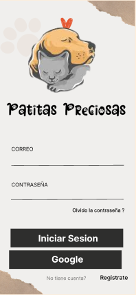
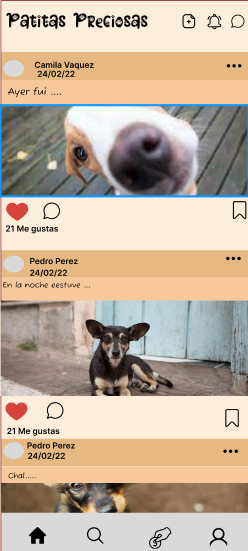

# PAtitas Preciosas

# # Una Red Social creada para las personas amantes de los Animales 

Esta red social es creada como una iniciativa para fomentar que menos animales se encuentren
sufriendo en las calles, los principales usuarios son las personas amantes de estos. 
Permite a cualquier usuario registrarse a la <red social> una vez echo , ya cuenta 
con un correo y contraseña, tambien se puede registrar con una cuenta de google y acceder al 
home donde el usuario puede ; crear, editar,borrar, likear, ver la fecha de la publicacion y botpon de cerrar sesion. <veterinarias cercanas>   

# # # Producto Final de la red social 

  

![versión mobile]

#### ¿Quiénes son los principales usuarios del producto?

Toda las personas amantes de los animales que quieran adoptar perritos o gatitos; aquellas personas que tienen animales en casa y ya no puedan solventar el gasto o tengan que cambiar de domicilio, por ello tendrían que dar en adopción.
Un ejemplo es de un usuario que visualiza cachorros abandonados pasando pena, este usuario puede usar la red social y hacer la publicación para que personas interesadas puedan adoptarlo. 

#### ¿Cómo mi producto resuelve un problema o necesidad?

Mas usuarios tendrían la oprtunidad de poder adoptar, por ende disminuiría la población callejera 
de los animales y tendrian un hogar donde vivir.

#### prototipos de baja fidelidad   

 #### Prototipos de alta fidelidad

 

 #### Resumen del feedback recibido tanto de los coaches como de nuestras compañeras

 * En la primera presentación nos dijeron que nuestro login, debería ser de un color más llamativo, donde pueda incluir talvez imágenes de animalitos.
* Quitar opciones que no usariamos para que la página no se vea recargada. 
* En nuestro background cambiar el efecto lineal por un color sólido para no confundir a los usuarios. 

### Historias de Usuario 

#### HU1: Interfaz de Usuario

Yo como usuario de Patitas Preciosas 
Quiero acceder a una página amigable, donde pueda pueda visualizar las opciones de logueo
con facilidad.

criterios de aceptación:

* Tiene que existir un interfaz amigable y facil de acceder.
* Debe tener opciones de registro y de loguin.
* Debe tener la opción de poder loguearse con la cuenta de google.

#### HU 2: Registro de usuario

Yo como usuario amante de los animales
Quiero poder registrarme fácilmente con un correo electrónico y contraseña, 
de tal forma poder loguearme siempre. 

criterios de aceptación:

* Tiene que existir campos vacíos especificando al usuario para que ingrese sus datos(nombre,
apellido, correo electrónico contraseña y confirmación de contraseña).
* El correo electrónico debe ser única.
* La contraseña debe ser no menor a 8 carácteres.
* Cuando el usuario intente registrarse con un correo existente debe mostrar un mensaje 
diciendo que el correo ya existe y debe probar con otro correo electrónico.
* Todos los campos deben de estar completados, de lo contrario saldrá un mensaje 
diciendo, complete todo los campos.
* Debe tener un boton visible para que se complete el registro.  

#### HU3 Login de usuario 

Yo como usuario
quiero loguearme, tener mi cuenta personalizada
para poder compartir con la comunidad.

Criterios de aceptación:

* El usuario tendrá una vista amigable de login 
* Debe tener campos vacíos donde el usuario debe ingresar su correo y contraseña.
* 
* Dado que quiere loguearse ->el usuario ingresará directamente con su cuenta de google. 
* 
